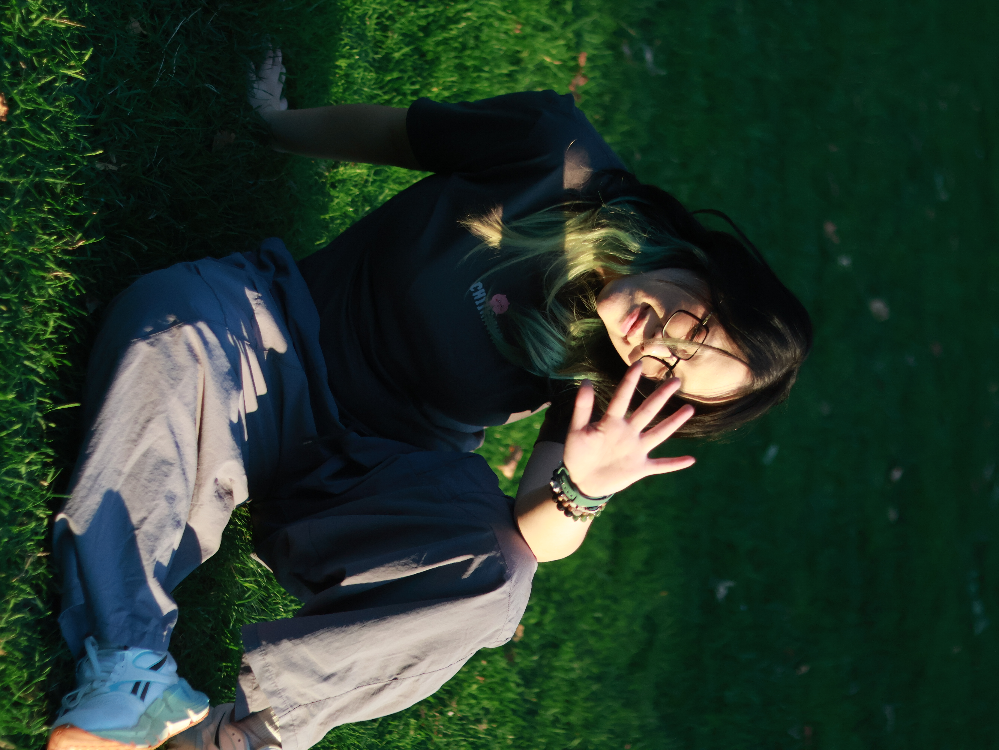

# Alex Nguyen's Portfolio 🎨

A modern, responsive portfolio website showcasing my work as an Interactive Media Design student at Fanshawe College. Built with clean code, smooth animations, and a focus on user experience.



## ✨ Features

- **Responsive Design** - Optimized for desktop, tablet, and mobile devices
- **Smooth Animations** - GSAP-powered scroll animations and transitions
- **Optimized Images** - Srcset implementation for fast loading on all devices
- **Custom Video Player** - Styled video player using Plyr.js
- **Contact Form** - PHP-powered contact form with success/error pages
- **Case Studies** - Detailed project breakdowns with galleries

## 🛠️ Built With

- **HTML5** - Semantic markup
- **Sass/SCSS** - 7-1 architecture pattern for maintainable styling
- **JavaScript** - Vanilla JS with GSAP for animations
- **PHP** - Contact form backend
- **GSAP** - ScrollTrigger animations
- **Plyr.js** - Custom video player

## 🎯 Featured Projects

### Gekk Earbuds
A vibrant earbuds branding project featuring 3D modeling, motion design, and web development. Inspired by Gekko from Valorant with a bold, quirky aesthetic.

**Tools:** Figma, Cinema 4D, After Effects, HTML, Sass, JavaScript

### Dr.Nut Rebranding
Reviving a forgotten 1960s soda brand with a fresh, retro-inspired identity. Complete rebrand including logo, brand guidelines, packaging design, and promotional materials.

**Tools:** Figma, Illustrator, Cinema 4D, After Effects, HTML, CSS, JavaScript

## 🚀 Getting Started

1. Clone the repository
```bash
git clone https://github.com/yourusername/portfolio.git
```

2. If you want to compile Sass:
```bash
npm install -g sass
sass --watch sass/main.scss css/main.css
```

3. For the contact form to work, deploy to a PHP-enabled server

## 📄 License

This project is for portfolio/educational purposes.

## 📬 Contact

- **Email:** npanh1903@gmail.com
- **LinkedIn:** [Alex Nguyen](https://www.linkedin.com/in/anh-nguyen-53280b266/)
- **Location:** London, Ontario, Canada

---

Made with ☕ and determination by Alex Nguyen | Interactive Media Design @ Fanshawe College